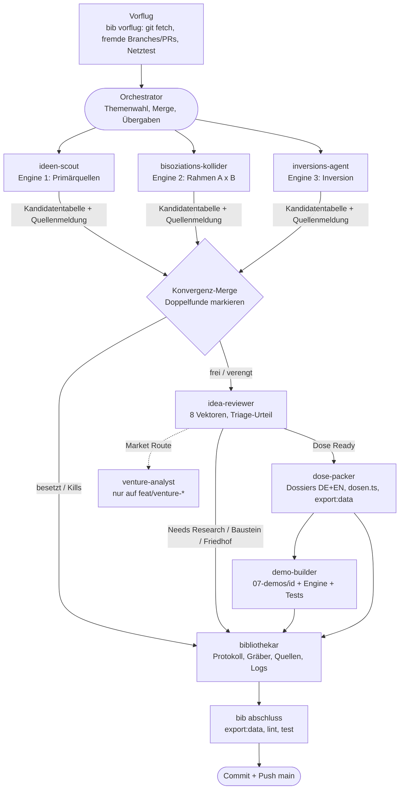
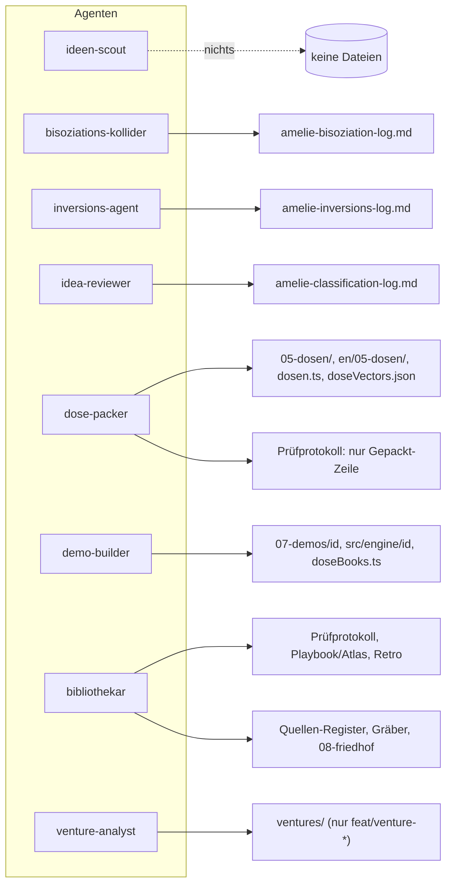
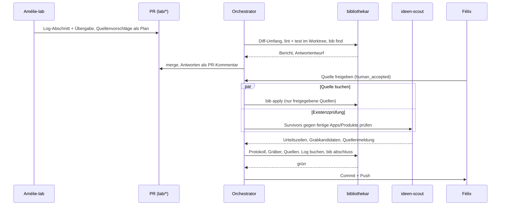

# Agenten, Übergaben und Schreibrechte (Diagramme)

Stand 30.09.2026 (Crew von der Kommandozeile seit 01.10.2026: dieselben Rollen als eigenständige Programme, siehe `amelie-kommandozeile.md` und für Menschen `amelie-agenten-fuer-menschen.md`). Quelle der Wahrheit sind `.claude/agents/*.md` (Rechte, Rückgabeformate) und `skills/amelie-orchestrator/` (Ablauf). Bei Änderungen dort dieses Blatt nachziehen. Mermaid rendert auf GitHub direkt.

## 1. Teamrunde: Ablauf und Übergaben

Die Agenten sprechen nicht miteinander. Jeder liefert einen Bericht an den Orchestrator, der die nächste Stufe füttert.

## 2. Wer darf was schreiben

Disjunkte Schreibrechte verhindern, dass zwei Agenten dieselbe Datei anfassen. Lesen dürfen alle, Kandidaten-Engines und Reviewer schreiben nur ihr eigenes Log.

`main` bleibt 100 % CC0; alles Kommerzielle liegt ausschließlich auf `feat/venture-*`.

## 3. Weg vom Schwesterprojekt (Lab → Amélie)

Lab-Läufe kommen als PR in `06-suche/` und werden vom Bibliothekar geprüft. Ein Lab-Lauf zählt in „Distance yield" erst mit, wenn ein Survivor ein Amélie-Urteil hat.

## Hinweis

Diese Diagramme zeigen Übergaben und Rechte, nicht die Laufzeit. Für Live-Ansicht einer Sitzung (Knotengraph, Tool-Aufrufe, Tokens) taugen `agent-flow` (`npx agent-flow-app`) oder `agents-observe`; siehe Recherche in der Sitzung vom 30.09.2026.
