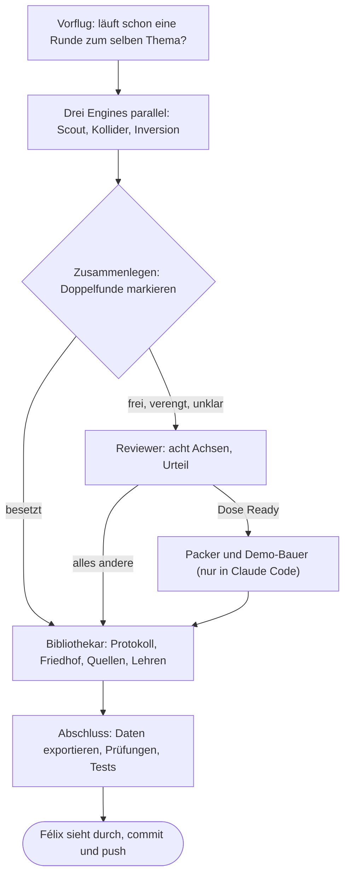

# Wer macht was in Amélie (in einfachen Worten)

Stand 01.10.2026. Dieses Blatt erklärt, welche Agenten es gibt, was sie tun, was sie dürfen und wie eine Runde abläuft. Befehle stehen im Handbuch [`amelie-kommandozeile.md`](amelie-kommandozeile.md); die genauen Übergaben und Schreibrechte als Diagramme in [`amelie-agenten-ablauf.md`](amelie-agenten-ablauf.md).

## Worum es geht

Amélie sucht Ideen für Werkzeuge, die erst mit neuer KI möglich wurden, und **verschenkt** sie an Leute mit dem passenden Auftrag (eine Behörde, einen Verband, ein Institut). Gebaut wird nur ein Gerüst. Das Schwierige ist nicht das Erfinden, sondern das Prüfen: Gibt es das schon? Wer würde es brauchen? Darum besteht fast die ganze Arbeit aus Suchen, Vergleichen und Aufschreiben, auch und gerade, wenn eine Idee stirbt.

## Die kurze Fassung

| Wer | Was er tut | Was er schreiben darf |
|---|---|---|
| **Ideen-Scout** | Liest eine echte Quelle (eine Norm, ein Bürgerforschungsprojekt, ein Förderprogramm), leitet Ideen ab und sucht, ob es sie schon gibt. | nichts |
| **Bisoziations-Kollider** | Stößt einen echten Bereich mit einem weit entfernten zusammen (Schmetterlingszählung × Tintenfisch-Tarnung) und behält nur, was eine echte Lücke öffnet. Prüft dann wie der Scout. | sein eigenes Logbuch |
| **Inversions-Agent** | Nimmt ein System, das Geld oder Gesetz hat (eine Gebührenordnung, eine Prüfpflicht), fragt, wer zahlt und wer die Last trägt, und dreht es um. Prüft dann wie der Scout. | sein eigenes Logbuch |
| **Reviewer** | Der Advocatus Diaboli. Bewertet jede überlebende Idee auf acht Achsen (neu? machbar? haltbar? gibt es Daten? macht es Spaß? …) und entscheidet: einpacken, weiter recherchieren, Teil einer anderen Idee, kommerziell oder Friedhof. | sein Bewertungslog |
| **Bibliothekar** | Das Gedächtnis. Trägt jedes Urteil ins Prüfprotokoll ein, begräbt tote Ideen mit Totenschein, pflegt das Quellenregister und schreibt die Lehren der Runde auf. | als Einziger das Gedächtnis |
| **Dosen-Packer** | Schreibt aus einer guten Idee eine „Dose“: ein zweisprachiges Dossier, das man verschenken kann. | Dosen |
| **Demo-Bauer** | Baut zur Dose ein kleines lauffähiges Gerüst mit Tests. | Demos |
| **Venture-Analyst** | Prüft, ob eine Idee, die als Geschenk nicht taugt, ein Geschäft wäre. Nur auf eigenen Zweigen, nie auf dem öffentlichen. | nur `ventures/` |

## Wörter, die hier oft vorkommen

- **Dose:** eine fertig verpackte Idee zum Verschenken (Dossier, Empfänger, erster Schritt, Gerüst).
- **Urteil:** `frei` (nichts Vergleichbares gefunden), `verengt` (gibt es halb, eine Restlücke bleibt), `unklar` (Suche lieferte nur Rauschen), `besetzt` (gibt es schon).
- **Prüfprotokoll:** die lange Liste jeder je geprüften Idee mit Urteil, Beleg und Datum, ab wann neu geprüft wird.
- **Friedhof und Totenschein:** Tote Ideen werden nicht gelöscht, sondern begraben: woran sie starben (gibt es schon, falsche Annahme, der Empfänger macht es selbst …), wer sie getötet hat und unter welcher Bedingung man das Grab wieder öffnen darf. So entstehen keine Wiedergänger.
- **Quellenregister:** alle Orte, an denen gesucht wurde, mit Zugangsweg und Ertrag. Agenten melden am Ende eine „Quellenmeldung“.
- **Besetzungsatlas:** Felder, die schon dicht sind („Gedenken und Zeitzeugen: dicht beim Empfänger“), damit niemand dort wieder sucht.
- **Evidenz Seite / Schnipsel:** Eine Seite wurde wirklich gelesen; ein Schnipsel ist nur ein Suchtreffer. Für „frei“ braucht es eine gelesene Seite.
- **Doppelfund:** Zwei Agenten finden unabhängig dieselbe Idee. Ein stärkeres Signal, aber kein Freifahrtschein.

## Wie eine Runde abläuft

1. **Vorflug:** Gibt es schon eine Runde oder einen offenen Vorschlag zum selben Thema? Zwei Sitzungen zum selben Thema haben früher die Suche verdoppelt.
2. **Drei Engines** suchen parallel auf demselben Thema, jede mit ihrer Methode. Jede hält ihre Ideen zuerst gegen das Gedächtnis (`bib find`) und sucht dann im Netz, **Empfänger zuerst**: Wer hätte überhaupt den Auftrag, so etwas zu nutzen?
3. **Zusammenlegen:** gleiche Ideen werden zusammengeführt. Was besetzt ist, geht direkt zum Bibliothekar.
4. **Reviewer:** bewertet den Rest. Eingepackt wird nur, was mindestens 24 von 35 Punkten hat und eine eigene Gegen-Suche übersteht. Die meisten Runden enden ohne Dose, und das ist normal: Gelernt wird trotzdem.
5. **Bibliothekar:** schreibt alles ins Gedächtnis, in einem Schritt, der ganz gelingt oder gar nicht.
6. **Abschluss:** Daten für die Webseite exportieren, alle Prüfungen und Tests laufen lassen, dann committen.

## Zwei Arten, die Agenten laufen zu lassen

| | In Claude Code | Von der Kommandozeile (die „Crew“) |
|---|---|---|
| Wie | Claude startet Subagenten aus `.claude/agents/` | `npm run agent -- <agent>` oder `npm run teamrunde -- "<Thema>"` |
| Modell | Claude | Gemini oder Claude über die eigene API, frei wählbar je Agent |
| Kosten | Claude-Credits | API-Guthaben (Gemini über Vertex AI: Cent-Beträge je Lauf) |
| Wer | alle acht Rollen | Scout, Kollider, Inversion, Reviewer, Bibliothekar |
| Anweisungen | dieselben Agentendefinitionen und Skills | dieselben Agentendefinitionen und Skills |
| Automatisierbar | nein | ja: Skripte, cron, JSON-Ausgabe, feste Exit-Codes |

Packer, Demo-Bauer und Venture-Analyst bauen Code und Dossiers. Sie bleiben vorerst in Claude Code.

## Sicherheitsregeln der Crew (warum man ihr trauen kann)

- **Die Agenten lesen nur.** Ihre Werkzeuge können Dateien lesen, im Repo suchen, die Lesebefehle des Gedächtnisses nutzen, Skills laden und Webseiten holen. Kein Werkzeug schreibt.
- **Jeder Bericht hat eine feste Form.** Am Ende steht ein Datenblock, den ein Programm prüft (zum Beispiel: „frei“ nur mit gelesener Seite, Punkte müssen richtig addiert sein, Totenschein vollständig). Passt die Form nicht, gibt es genau einen Korrekturversuch ohne neue Suche; sonst gilt der Lauf als unvollständig und wird nicht verwendet.
- **Geschrieben wird nur mit Freigabe** (`--write`), nur einmal je Lauf und nur dorthin, wo die Rolle es erlaubt. Das Programm schreibt, nicht das Modell.
- **Das Gedächtnis schreibt nur der Bibliothekar**, und auch er nur über `bib apply`: alles oder nichts, mit Rechteliste, Protokoll jedes Schreibvorgangs und Schutz vor doppeltem Buchen. Vorher prüft er seinen Plan im Trockenlauf gegen das echte Gedächtnis.
- **Übungsläufe** (`--mock`) kosten nichts und schreiben nie ins Gedächtnis.
- **Jeder Lauf hinterlässt eine Akte** (`06-suche/agent-runs/`): Auftrag, Modell, jeder Werkzeugaufruf, Bericht, Daten, Kosten. Man kann also nachsehen, ob ein Agent wirklich gesucht oder nur behauptet hat.

## Das Schwesterprojekt (Amélie-lab)

Das Lab prüft Amélies Ideen von außen: Gemini sucht im Netz und versucht zu beweisen, dass eine Idee **nicht** neu ist, ohne Amélies eigene Urteile zu kennen. Dazu erfindet es mit denselben Methoden (Lacunar, Inversion) neue Kandidaten. Seine Ergebnisse kommen als Vorschläge zurück (`06-suche/proposals/`, Prüfung mit `npm run lab`) und gelten erst, wenn Amélie sie selbst geprüft hat. Die Crew hier ist nach demselben Muster gebaut: eigene Programme, feste Datenformen, ein einziger Schreiber.

## Wo was liegt

| Was | Wo |
|---|---|
| Rollen der Agenten | `.claude/agents/*.md` |
| Methoden (Skills) | `.claude/skills/` (und `skills/`) |
| Ablauf einer Teamrunde | `.claude/skills/amelie-orchestrator/` |
| Crew-Programme | `scripts/agent-run.mjs`, `scripts/crew/` |
| Gedächtnis | `06-suche/` (Protokoll, Playbook, Quellen, Logs), `src/data/graeber.json`, `08-friedhof/` |
| Dosen | `05-dosen/`, `en/05-dosen/`, `07-demos/` |
| Akten der Crew-Läufe | `06-suche/agent-runs/` (nur lokal) |
