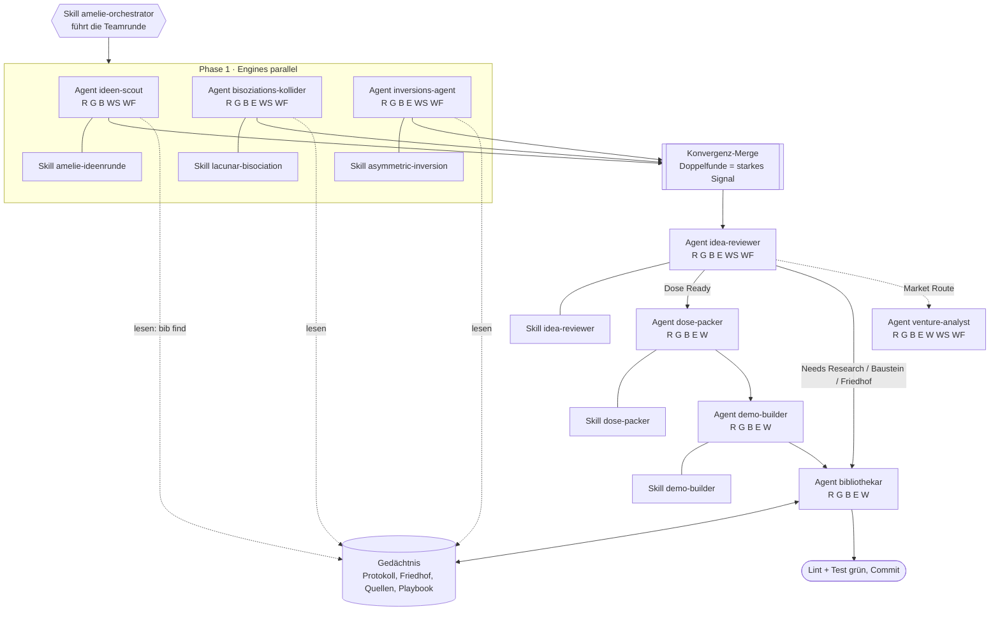

# Testlauf der Crew-Verdrahtung: Agenten, Skills, Modelle, Werkzeuge

Zweck: lokal prüfen, ob alle Agenten und Skills zusammenarbeiten. Thema des Testlaufs: **Starkregen und Überflutungsvorsorge im Quartier** (im Protokoll nur 1 Treffer, `verengt`, also dünnes Feld).

## 1. Gesamtbild (abstrakt)

Werkzeuge in Klammern: R=Read, G=Grep/Glob, B=Bash (in der CLI-Crew nur `bib`/`quellen` lesend), E=Edit, W=Write, WS=WebSearch, WF=WebFetch.



## 2. Tabelle: Agent, Skill, Modell, Werkzeuge, Schreibrecht

| Agent | Skill | Werkzeuge (Claude Code) | Schreibt |
|---|---|---|---|
| ideen-scout | amelie-ideenrunde | Read, Grep, Glob, Bash, WebSearch, WebFetch | nichts |
| bisoziations-kollider | lacunar-bisociation | Read, Grep, Glob, Bash, Edit, WebSearch, WebFetch | `amelie-bisoziation-log.md` |
| inversions-agent | asymmetric-inversion | wie Kollider | `amelie-inversions-log.md` |
| idea-reviewer | idea-reviewer | wie Kollider | `amelie-classification-log.md` |
| dose-packer | dose-packer | Read, Grep, Glob, Bash, Edit, Write | `05-dosen/`, `dosen.ts`, Export |
| demo-builder | demo-builder | wie Packer | `07-demos/<id>/`, `src/engine/<id>/` |
| bibliothekar | keiner | wie Packer | Protokoll, Friedhof, Quellen, Playbook |
| venture-analyst | keiner | Read, Grep, Glob, Bash, Edit, Write, WebSearch, WebFetch | `ventures/` |

**Modelle.** Keine Agentendefinition in `.claude/agents/` setzt ein `model:`. Das gilt in zwei Welten:
- **Claude Code (Subagenten):** jeder Agent erbt das Modell der laufenden Sitzung. Soll ein Agent ein anderes bekommen, trage `model:` in sein Frontmatter ein oder setze es beim Aufruf.
- **Kommandozeilen-Crew:** Modell je Agent aus `scripts/model-compare/models.local.json` (git-ignoriert, liegt nicht im Repo). Reihenfolge: `--model`, dann `agents.<agent>`, dann `crew`, `librarian`, `judge`, erstes Modell. Die Vorlage `models.example.json` nennt `claude-opus-5-5` (Vertex, Richter), `claude-sonnet-5-5` (Vertex) und `gemini` mit leerer Id (`SET_ME`). Welche Zuordnung bei dir gilt, steht nur in deiner lokalen Datei: `npm run agent -- list` bzw. `cat scripts/model-compare/models.local.json`.

**Werkzeug-Übersetzung in der CLI-Crew:** Read → `read_file`, Grep/Glob → `search_repo`, Bash → `run_cli` (nur Lesebefehle), WebFetch → `web_fetch`, WebSearch → `web_search`; dazu immer `list_skills` und `load_skill`. Edit und Write gibt es dort nie, geschrieben wird nur vom Programm mit `--write`. Der Lab-Bibliothekar darf zusätzlich `call_agent` (nur lesend, Tiefe 1, höchstens 3).

Packer, Demo-Bauer und Venture laufen weiter nur in Claude Code.

## 3. Testlauf in Stufen (vom billigsten zum echten)

Vorbereitung (einmal):

```bash
export PATH="/home/felix/.nvm/versions/node/v26.3.1/bin:$PATH"
git fetch origin && git checkout claude/compassionate-wozniak-vky2x6 && git pull
npm install
cp scripts/model-compare/models.example.json scripts/model-compare/models.local.json   # Modell-Ids selbst eintragen
npm run bib -- vorflug --netz
```

| Stufe | Befehl | Prüft | Kosten |
|---|---|---|---|
| 0 | `npm test -- crew` und `npm run lint` | Verträge, Profile, Gedächtnis-Drift | 0 |
| 1 | `npm run agent -- list` | Profile und Schreibwege sichtbar | 0 |
| 2 | `npm run teamrunde -- "Starkregen und Überflutungsvorsorge im Quartier" --mock` | ganze Kette ohne Netz, schreibt nie | 0 |
| 3 | `npm run agent -- ideen-scout --thema "Starkregen und Überflutungsvorsorge im Quartier"` | ein echter Agent, Werkzeuge, Vertrag, Akte | klein |
| 4 | `npm run agent -- runs` und `npm run agent -- show latest:ideen-scout` | Akte lesen, JSON-Block, Tool-Aufrufe | 0 |
| 5 | `npm run teamrunde -- "Starkregen und Überflutungsvorsorge im Quartier"` | volle Kette, Trockenlauf des Bibliothekars | mittel |
| 6 | gleicher Befehl mit `--write` (erst nach Durchsicht von Stufe 5) | `bib apply`, Logs, `abschluss` | mittel |

Einzelne Teile testen: `--engines "ideen-scout"` begrenzt die Engines, `--no-delegate` (beim Lab-Bibliothekar) schaltet `call_agent` ab, `npm run agent -- write <run> --dry-run` zeigt den Schreibweg eines früheren Laufs.

## 4. Worauf du achten solltest (Abnahme)

- Jede Engine endet mit gültigem JSON-Block (Exit 0). Reparaturaufruf nötig = Prompt prüfen.
- In der Akte stehen echte `bib find`-Aufrufe vor jedem Urteil, Empfänger zuerst.
- Kein `frei` für etwas, das im Friedhof liegt (Kennzahl aus `npm run vergleich`).
- `merge` meldet Doppelfunde zwischen den Engines (erwartet bei dünnem Feld: wenige).
- Trockenlauf: `plan_check` des Bibliothekars grün, bevor `--write` kommt.
- Nach `--write`: `git status` zeigt nur Logs, Protokoll, Gräber, Quellen, Playbook; `npm run lint && npm test` grün.
- Bekannt offen: Claude-Adapter (direkt, Vertex) sind nie live gelaufen. Wenn Stufe 3 dort scheitert, ist das der erste Verdacht.
