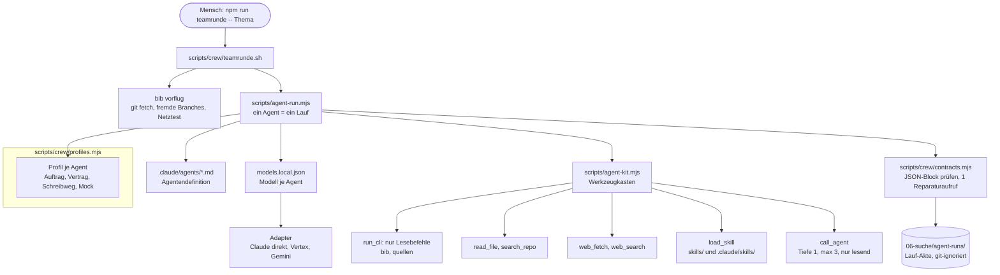
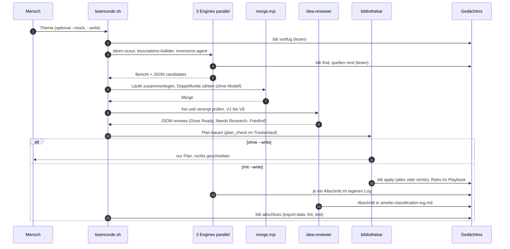
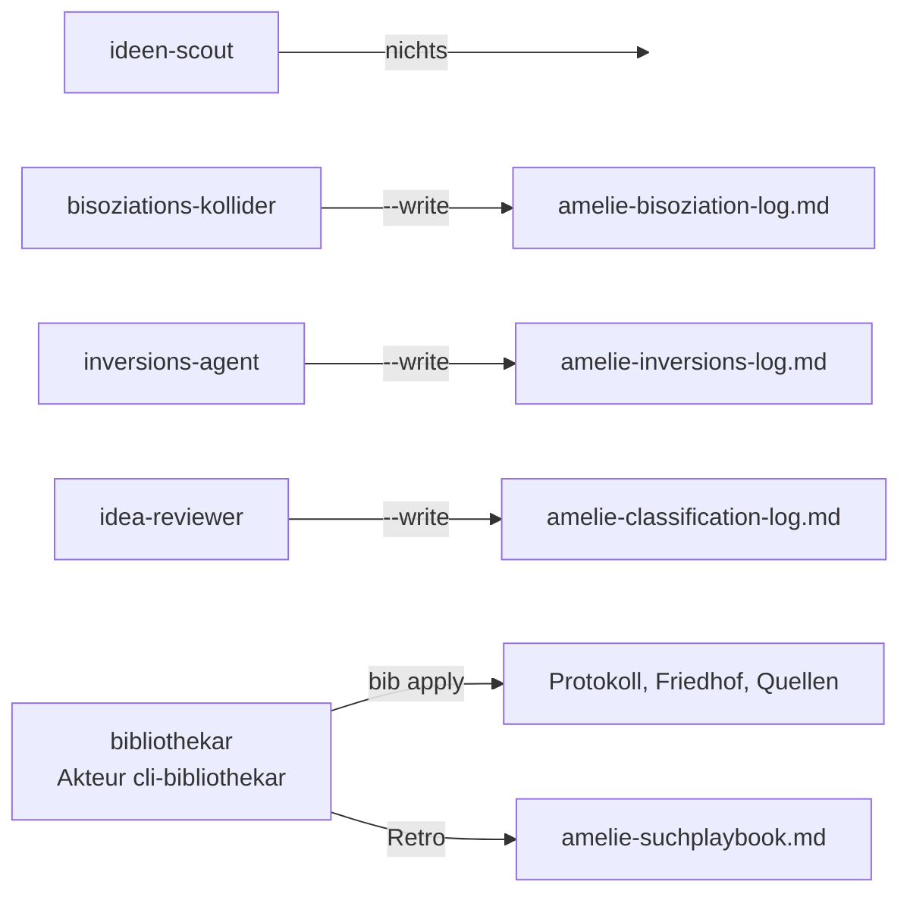

# Testlauf der Crew-Verdrahtung: Diagramme und Ablauf

Zweck: lokal prüfen, ob alle Teile der Kommandozeilen-Crew zusammenarbeiten (Skripte, Agentendefinitionen, Skills, Werkzeuge, Gedächtnis). Thema des Testlaufs: **Starkregen und Überflutungsvorsorge im Quartier** (im Protokoll nur 1 Treffer, `verengt`, also dünnes Feld).

## 1. Gesamtbild: wer ruft wen



## 2. Ablauf der Teamrunde



## 3. Wer darf wohin schreiben



Packer, Demo-Bauer und Venture laufen weiter nur in Claude Code, nicht in dieser Kette.

## 4. Testlauf in Stufen (vom billigsten zum echten)

Vorbereitung (einmal):

```bash
export PATH="/home/felix/.nvm/versions/node/v26.3.1/bin:$PATH"
git fetch origin && git checkout claude/compassionate-wozniak-vky2x6 && git pull
npm install
cp scripts/model-compare/models.example.json scripts/model-compare/models.local.json   # Modell-Ids selbst eintragen
npm run bib -- vorflug --netz
```

| Stufe | Befehl | Prüft | Kosten |
|---|---|---|---|
| 0 | `npm test -- crew` und `npm run lint` | Verträge, Profile, Gedächtnis-Drift | 0 |
| 1 | `npm run agent -- list` | Profile und Schreibwege sichtbar | 0 |
| 2 | `npm run teamrunde -- "Starkregen und Überflutungsvorsorge im Quartier" --mock` | ganze Kette ohne Netz, schreibt nie | 0 |
| 3 | `npm run agent -- ideen-scout --thema "Starkregen und Überflutungsvorsorge im Quartier"` | ein echter Agent, Werkzeuge, Vertrag, Akte | klein |
| 4 | `npm run agent -- runs` und `npm run agent -- show latest:ideen-scout` | Akte lesen, JSON-Block, Tool-Aufrufe | 0 |
| 5 | `npm run teamrunde -- "Starkregen und Überflutungsvorsorge im Quartier"` | volle Kette, Trockenlauf des Bibliothekars | mittel |
| 6 | gleicher Befehl mit `--write` (erst nach Durchsicht von Stufe 5) | `bib apply`, Logs, `abschluss` | mittel |

Einzelne Teile testen: `--engines "ideen-scout"` begrenzt die Engines, `--no-delegate` (beim Lab-Bibliothekar) schaltet `call_agent` ab, `npm run agent -- write <run> --dry-run` zeigt den Schreibweg eines früheren Laufs.

## 5. Worauf du achten solltest (Abnahme)

- Jede Engine endet mit gültigem JSON-Block (Exit 0). Reparaturaufruf nötig = Prompt prüfen.
- In der Akte stehen echte `bib find`-Aufrufe vor jedem Urteil, Empfänger zuerst.
- Kein `frei` für etwas, das im Friedhof liegt (Kennzahl aus `npm run vergleich`).
- `merge` meldet Doppelfunde zwischen den Engines (erwartet bei dünnem Feld: wenige).
- Trockenlauf: `plan_check` des Bibliothekars grün, bevor `--write` kommt.
- Nach `--write`: `git status` zeigt nur Logs, Protokoll, Gräber, Quellen, Playbook; `npm run lint && npm test` grün.
- Bekannt offen: Claude-Adapter (direkt, Vertex) sind nie live gelaufen. Wenn Stufe 3 dort scheitert, ist das der erste Verdacht.
